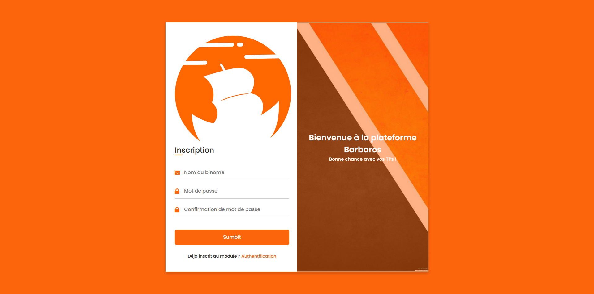
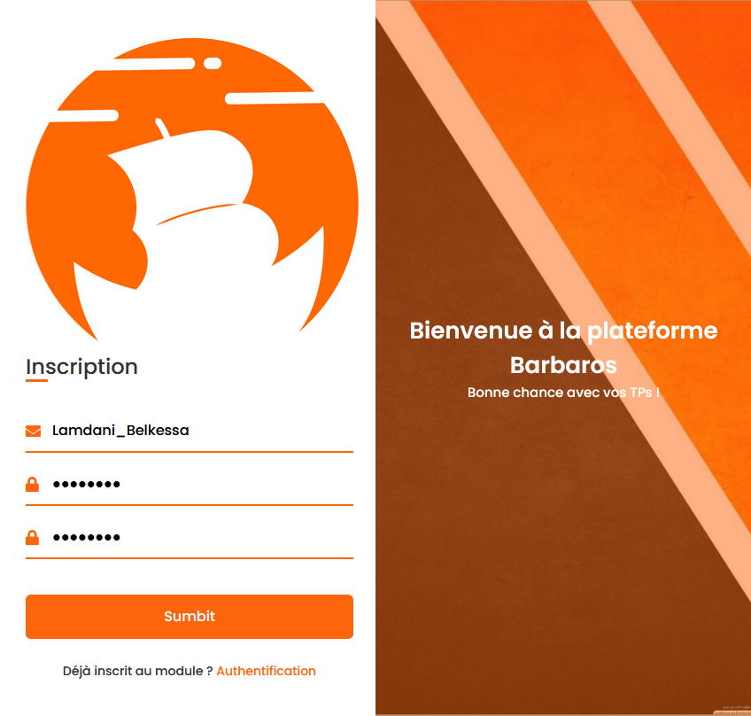
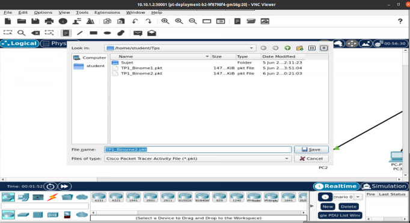

# BARBAROS :ship: :anchor:

> Barbaros web application, provides a quality solution to use different tools/dev environements...etc. Built on a microservices architecture,
> where tools and dependencies are dockerized and orchestrated using kubernetes, the later being configured on a fully distributed cluster made of : 1 to 2 master nodes, multiple worker nodes and NFS server.
> registration and authentication of students to get a personal TP's pod is automated via a web plateform built with Nodejs, express and MangoDB. 

## Table of Contents
* [General Info](#general-information)
* [Technologies Used](#technologies-used)
* [Features](#features)
* [Screenshots](#screenshots)
* [Setup](#setup)
* [Usage](#usage)
* [Project Status](#project-status)
* [Room for Improvement](#room-for-improvement)
* [Acknowledgements](#acknowledgements)
* [Contact](#contact)
* [License](#license)

## General Information
- This is the final product of a semester-long school project, example subjects we took are : SYS1/2 (bash), RES1/2/3 (Packet tracer), OOP/ALOG/IGL (IntelliJ)
- The main problem is to make it easy for teachers and students to use specific tools and environements required for a subject's labs.
- Some frequent troubles are : 1CP and 2CP students waste time unnecessarly to install tools/software for labs; incompatibility between versions; some students use linux while others use windows or macOS; teachers need to pass Lab materials through disks or mail; technical support used to work with VMs that are unnecessarly heavy and less portable ...
- The problems listed above were the main motivation that pushed us to think out a solution based on new technologies with the main focus being an easy-to-use and production-ready product.
<!-- You don't have to answer all the questions - just the ones relevant to your project. -->

## Technologies Used
#### For the core cluster
- VMware
- Docker
- Kubernetes (kubeadm for building the cluser)
- VNC

#### For the web app
- MERN stack

## Features
What can be done:
- Registering and authenticating through the web app
- Accessing your specific pod through cluster's IP adress and port (each pair of students has one) 
- Teachers can put/retrieve work directly from the NFS server
- Students can access ressources of LABs in the NFS server and submit/save their current work

## Screenshots

*Figure 1: Main page of the web app*

*Figure 2: Registering process, port being provided automatically in the backend*

*Figure 3: View of packet tracer as used from the plateforme*

## Setup
1- Run all the VMs that make up the cluster (on a single machine or distributed through a LAN network), it was successfully tested with 1 master node, 2 worker nodes and NFS server. (You can contact us if you need a snapshot of the VMs)

2- Download RealVNC (the VNC client to view the running pod)

3- Download Nodejs and relevant dependencies (mangoose, express, axios, ... etc) run the backend with 'npm start'

4- Open the webpage 'index.html'

That's it !

## Usage
A student registers himself, the backend verifies if he belongs to the subject's students list and if it's the first time registering using the infos stored in the database. Once registered, the student authenticates himself and will be provided a pod (port number) which will redirect him to the VNC client view.

## Project Status
Project is: _complete_ 

## Room for Improvement

Room for improvement:
- Automating the generation of the YAML configuration files (PV, PVC, service config file, deployement ...)

## Acknowledgements
We would like to thank whoever played a role to fulfill this project
- Our teachers : Mr. Amrouche Hakim, Mr. Hamani Nacer and Mr. Sehad Abdenour for their guidance.
- Many thanks Mr. Meraghni Oussama for sharing with us concrete knoweledge.

## Contact
Created by Barbaros Team :
> - BELKESSA Linda (CE) (il_belkessa@esi.dz)
> - LAMDANI Wilem (iw_lamdani@esi.dz)
> - DJABELKHIR Sara (is_djabelkhir@esi.dz)
> - BOUZOUAD Meriem (im_bouzouad@esi.dz)
> - CHELLAT Hatem (kh_chellat@esi.dz)
> - BENHAMADI Yasmine (iy_benhamadi@esi.dz)

## License
BARBAROS TEAM | Ecole Nationa Supérieur d'Informatique d'ALGER 2021-2022.

